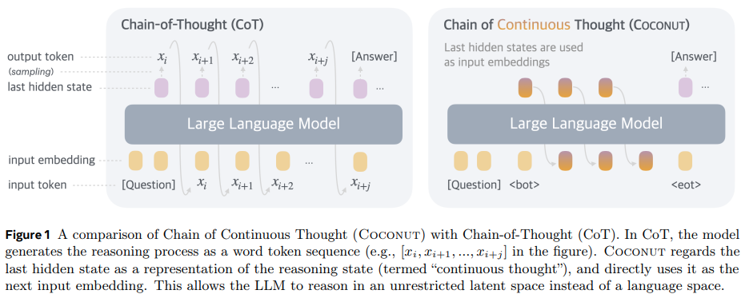

</img>

## Coconut (wip)

Implementation of Coconut, proposed by the paper <a href="https://arxiv.org/abs/2412.06769">Training Large Language Models to Reason in a Continuous Latent Space</a> out of FAIR, in Pytorch

## Citation

```bibtex
@inproceedings{Hao2024TrainingLL,
    title   = {Training Large Language Models to Reason in a Continuous Latent Space},
    author  = {Shibo Hao and Sainbayar Sukhbaatar and DiJia Su and Xian Li and Zhiting Hu and Jason Weston and Yuandong Tian},
    year    = {2024},
    url     = {https://api.semanticscholar.org/CorpusID:274610816}
}
```
